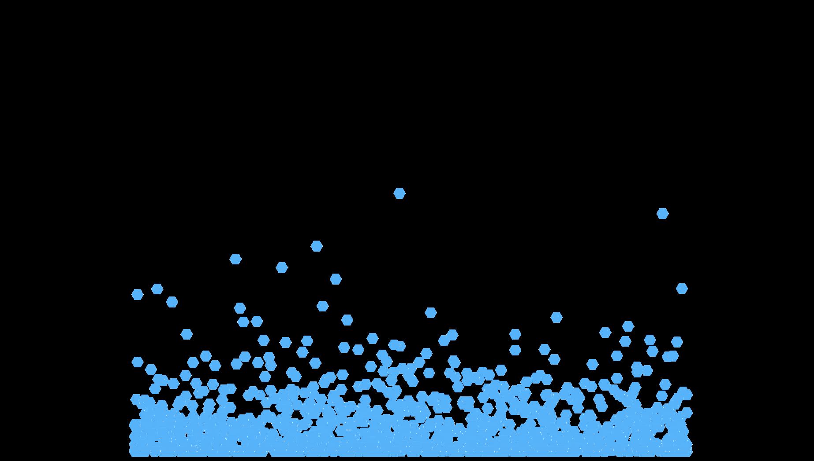

# Three-Particles
Recreation of part of my team's CS184's final project in ThreeJS instead of C++ and OpenGL.

# Things to do
 - Correct shader image billboarding
 - Fix physics bugs
 - Optimize
 - Add velocity-based coloring
 - Add mouse interactivity
 - Add OpenCV (if possible)

# Screenshots
</img>

# Credits
- CS184 Team members: <a href="https://github.com/FlyingSpringrol">Brian Aronowitz</a>, Will Huang
- three.js <a href="https://threejs.org/examples/?q=instan#webgl_buffergeometry_instancing_billboards">examples/buffergeometry/instancing/billboards</a>